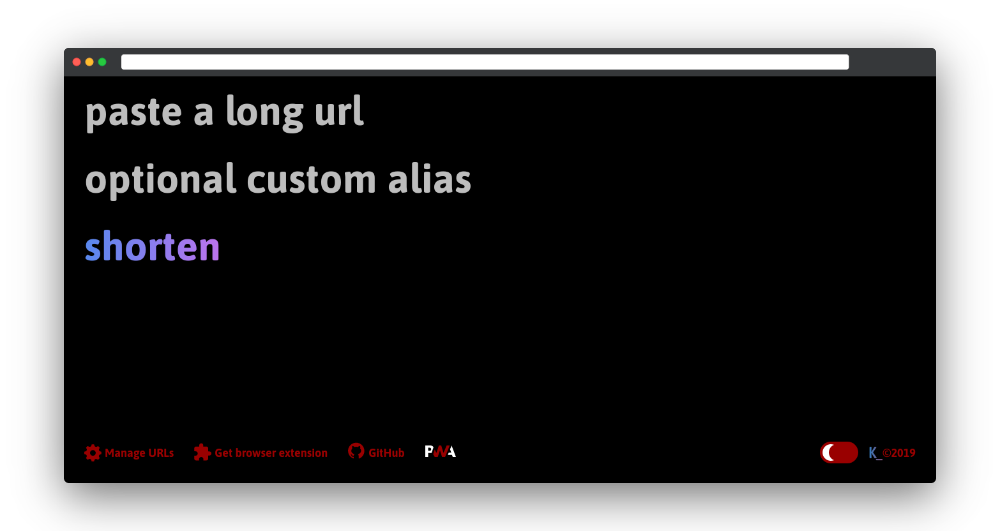
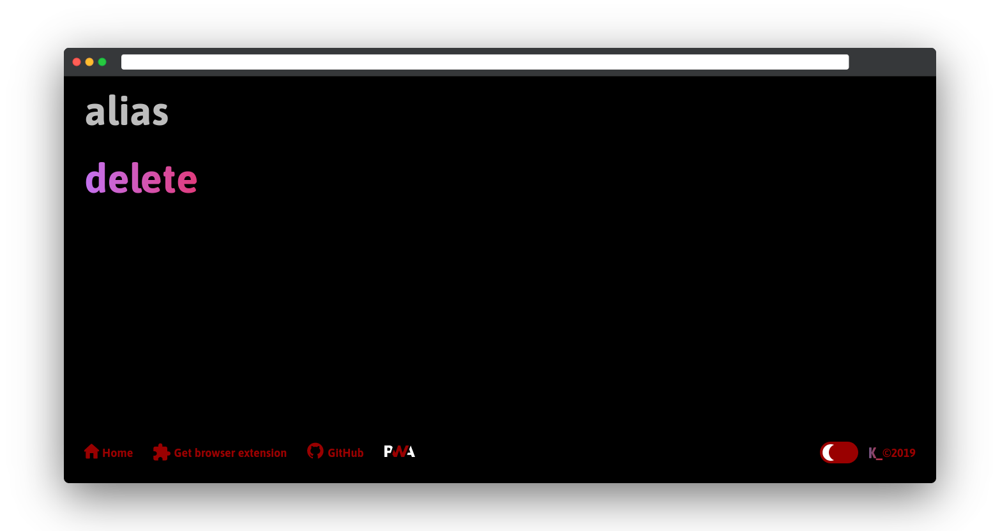

#  kotinga

### :link: Kotinga is a fork of the modern URL shortener with support for custom alias by [Liyas Thomas](https://github.com/liyasthomas)

   
  
  
   

### Features :sparkles:

:heart_eyes: **URL shortning made simple**: kotinga uses [jsonstore.io](https://www.jsonstore.io) to  store data on an endpoint JSON file using HTTPS requests. It works on any url.

:heart: **No server side logging**: Your privacy is important for us. We never log, collect or prompt to sell your data to anyone.

:fire: **Custom and random alias support**: Add your own custom alias or generate a random one.

:1234: **Generate QR code**: Create and download shortened URL's QR code.

:alembic: **Manage URLs**: Delete already created alias to update/create new URLs.

:zap: **Performance**: kotinga is a thin web app on top of HTML, CSS and JavaScript. Being a Progressive web app, kotinga offers lightning fast loading and offline support via workbox and service worker.

:information_desk_person: **Browser extension**:  Get mnmlurl [Chrome browser extension](https://github.com/liyasthomas/mnmlurl-extension)

**IMPORTANT: Kotinga is an experimental project. Don't shorten sensitive contents/URLs with it. jsonstore.io endpoints are always public making shortened URLs visible for everyone.**

---

## Built with

* HTML - For the web framework
* CSS - For styling components
* **[Chromium](https://github.com/chromium/chromium)** - Thanks for being so fast!

---

## Versioning

This project is developed by [Liyas Thomas](https://github.com/liyasthomas) using the [Semantic Versioning specification](https://semver.org). For the versions available, see the [releases on this repository](https://github.com/liyasthomas/mnmlurl/releases).

---

## Authors

### Lead Developers
* [**Liyas Thomas**](https://github.com/liyasthomas) - *Author*

### Testing and Debugging
* [Liyas Thomas](https://github.com/liyasthomas)

### Contributors
* [Contributors](https://github.com/liyasthomas/mnmlurl/graphs/contributors)

See also the list of [contributors](https://github.com/liyasthomas/mnmlurl/graphs/contributors) who participated in this project.

---

## License

This project is licensed under the [MIT License](https://opensource.org/licenses/MIT) - see the [LICENSE](LICENSE) file for details.

---

## Acknowledgments

* Hat tip to anyone who's code was used
* Inspirations:
	* [Glitch](https://glitch.com)
	* [tiny.cc](https://tiny.cc)
